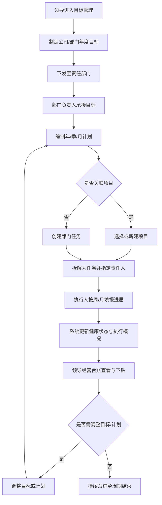
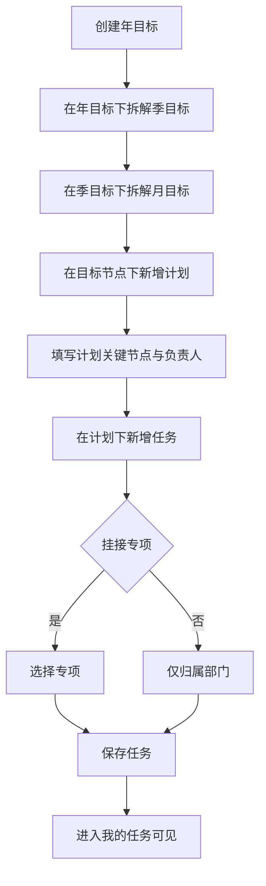
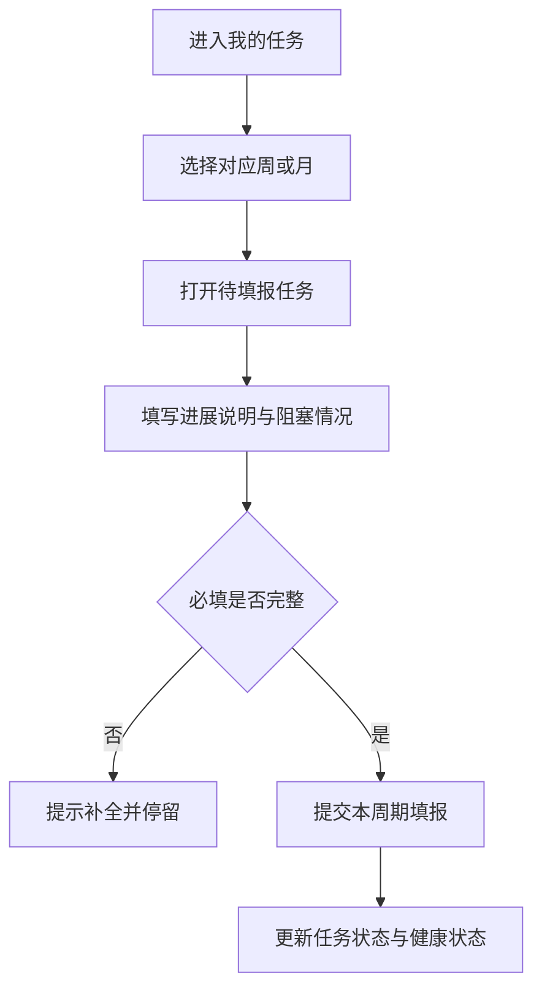
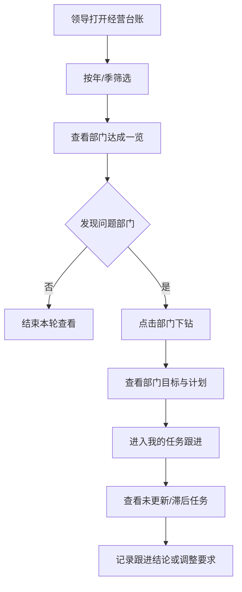
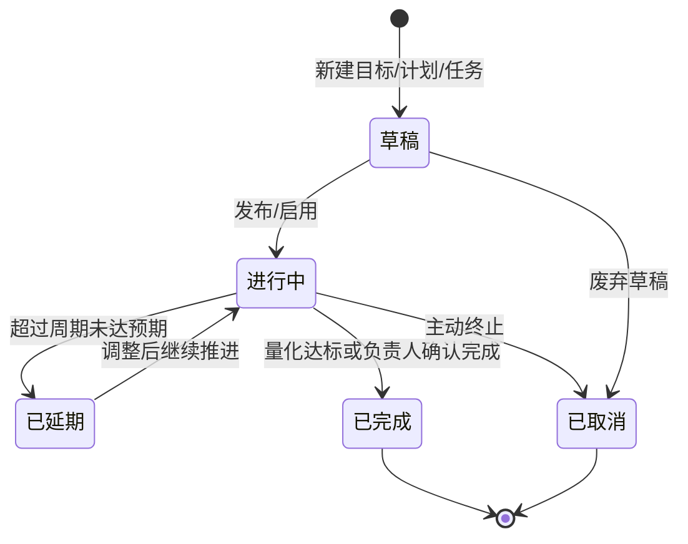
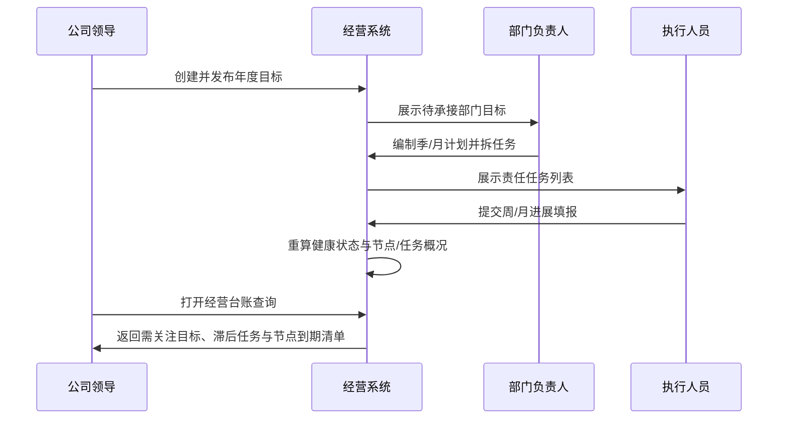
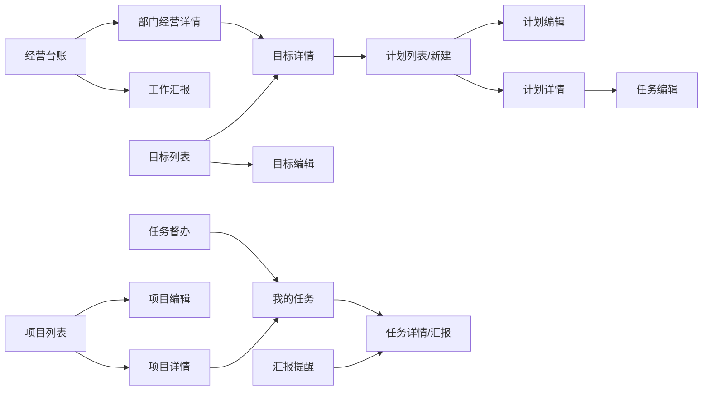

# 经营目标管理系统 PRD

| 项目 | 内容 |
| --- | --- |
| 产品名称 | 经营目标管理系统 |
| 当前版本 | v1.0.0 |
| 版本更新时间 | 2026-08-26 |
| 版本迭代说明 | **移除完成率口径**；工作汇报与汇报提醒**不合并**，增加填报覆盖摘要与联动规则 |
| 文档状态 | 持续在当前版本 v1.0.0 迭代（用户约定：未主动说明新版本则始终改当前版） |

---

## 目录

- [1. 产品概述](#1-产品概述)
- [2. 结论与范围](#2-结论与范围)
- [3. 业务流程](#3-业务流程)
- [4. 功能模块总览](#4-功能模块总览)
- [5. 用户交互路径 User Flows](#5-用户交互路径-user-flows)
- [6. 页面清单与跳转关系](#6-页面清单与跳转关系)
- [7. 字段与状态说明](#7-字段与状态说明)
- [8. 非功能性需求](#8-非功能性需求)
- [9. 风险项](#9-风险项)
- [10. 待确认](#10-待确认)

---

## 1. 产品概述

### 1.1 产品定位

面向**码头日常运营**的经营目标对齐与过程可视系统（非软件产品研发场景）：按**部门 / 专项**双维度管理目标与任务，支持**年、季、月、周**周期填报，让管理层随时掌握「目标是什么、做到哪、卡在哪」。

典型对象示例：装卸效率、泊位周转、堆存周转、设备完好率、安全环保、班组出勤、商务箱量等。

> 说明：消息、审批、角色与菜单权限由公司统一内部平台提供，本 PRD **不设计**对应模块与页面。

### 1.2 产品目标

| 目标 | 说明 | 优先级 |
| --- | --- | --- |
| 目标可下达 | 领导可制定公司/部门级经营目标与计划 | P0 |
| 目标可管理 | 目标含介绍、截止时间；状态可改且**必须填写原因** | P0 |
| 目标可分解 | 部门将目标拆为可执行任务，挂靠**专项**可选 | P0 |
| 过程可填报 | 按年/季/月/周维护计划与进展 | P0 |
| 结果可看见 | 领导按部门/专项查看目标达成与跟进状态 | P0 |
| 视图可切换 | ~~任务周/月视图菜单~~ → 任务中心以「我的任务 / 任务督办 / 汇报提醒」为主入口 | P0 |

### 1.3 用户角色定义

| 角色 | 核心诉求 | 典型动作 |
| --- | --- | --- |
| 公司领导 | 掌握各部门目标与达成情况 | 制定/调整目标；查看经营台账；下钻部门/专项 |
| 部门负责人 | 承接公司目标并拆解落地 | 接收目标；拆计划/任务；分配责任人；汇总进度 |
| 专项负责人 | 在专项维度推进任务 | 维护专项任务；周/月填报；标记风险 |
| 执行人员 | 明确本人任务与进度 | 填报周/月进展；更新完成情况 |

### 1.4 核心业务对象关系（文字）

```
公司/部门目标（年 → 季 → 月，依次拆解，禁止跳级）
  └─ 目标计划（可挂年/季/月任一节点；一目标多计划）
       └─ 任务（可关联专项）
            └─ 周期填报（月/周进展）
专项（可选挂载，如设备专项、安全专项、堆场专项）
```

---

## 2. 结论与范围

### 2.1 结论前置

**v1.0.0 以「目标 → 计划 → 任务 → 汇报填报 → 领导台账」闭环为主链路**；分部门、分**专项**管理；目标含介绍、截止时间与可改状态（改状态必填原因）；任务中心含我的任务、任务督办、汇报提醒；**全链路不使用完成率（%）**，改以「量化达成、健康状态、关键节点、任务执行概况」展示进度（适配计划/任务动态创建）；不建设独立审批/消息/权限配置页面。

### 2.2 包含范围（In Scope）

| 模块 | 说明 | 优先级 |
| --- | --- | --- |
| 经营台账 | 领导总览目标达成、进度、风险 | P0 |
| 目标管理 | 制定、介绍、截止时间、状态修改（必填原因）、分解 | P0 |
| 计划管理 | 年/季/月计划编制与关联目标 | P0 |
| 任务中心 | 我的任务、任务督办、汇报提醒；任务创建/分配/进展更新 | P0 |
| 专项管理 | 专项建档、归属部门、挂接任务（原「项目」） | P0 |
| 工作台 | 按部门查看目标与任务进展（原「部门工作台」） | P0 |
| 任务跟踪评论 | 任务大弹窗内评论、附件、编辑/删除本人评论 | P0 |
| 汇报提醒 | 未填周报/月报人员清单 + 一键催填（归属任务中心） | P0 |
| 合同管理 | 录入已签合同；统计合同总数、合同总额、回款总额、剩余收款 | P0 |
| 收款管理 | 必须关联合同登记收款；统计本年计划收款（独立配置）、累计收款、剩余收款 | P0 |

### 2.3 交互约束（本轮补充）

| 约束 | 说明 | 优先级 |
| --- | --- | --- |
| 新增统一弹窗 | 目标 / 计划 / 任务 / 专项的「新建、编辑」均使用标准 UI 弹窗 | P0 |
| 详情统一弹窗 | 目标 / 计划 / 任务 / 专项 / 部门经营详情均在弹窗内查看 | P0 |
| 目标状态变更 | 修改目标状态时**必须填写变更原因**，否则不可保存 | P0 |
| 目标周期与截止 | 目标分为年/季/月三级；各级均有周期值与截止时间 | P0 |
| 目标拆解递进 | 先建年目标 → 拆季目标 → 再拆月目标；季必须挂年，月必须挂季；禁止年直接拆月 | P0 |
| 目标关联展示 | 上下级仅做关联展示与下钻，不做下级指标强制加总校验 | P0 |
| 进度展示口径 | **全链路不使用完成率（%）**；目标看量化达成+健康状态，计划看关键节点+任务概况，任务看状态+进展说明 | P0 |
| 工作台 | 部门人员默认进入本部门工作台，查看本部门目标、计划、任务 | P0 |

### 2.4 不包含范围（Out of Scope）

| 项 | 说明 |
| --- | --- |
| 消息中心 / 待办推送本体 | 走内部平台；本系统仅提供「提醒」业务动作与待提醒清单 |
| 审批流配置与审批页 | 走内部平台 |
| 角色、菜单、按钮、数据权限配置页 | 走内部平台 |
| 复杂 OKR 评分算法 / 完成率（%）汇总 | 首版不采用；以健康状态 + 量化指标 + 关键节点替代 |
| 财务核算、预算系统对接 | 非本版 |
| 移动端专属能力设计 | 待确认终端后再拆 |

### 2.5 三类场景总览

| 类型 | 要点 |
| --- | --- |
| 正常流程 | 领导定目标 → 部门拆计划/任务 → 责任人周月汇报 → 汇报提醒催补 → 工作汇报汇总 → 经营台账跟进 |
| 边界情况 | 无项目仅部门任务；目标跨部门；周期末未填报；目标变更已有任务；评论仅文字无附件【待确认】 |
| 异常兜底 | 无权限可见范围外数据；必填缺失不可提交；周期冲突；目标删除有下级数据；提醒失败提示重试 |

---

## 3. 业务流程

### 3.1 完整业务流程图



**文字解读：** 业务主轴是「定目标 → 拆计划/任务 → 周期填报 → 看板跟进」；项目为可选挂载维度；调整可回流到计划编制。

### 3.2 子业务流程：目标分解与任务创建



**文字解读：** 目标必须按年→季→月递进创建，不可跳级；计划挂在任一已存在的目标节点上；任务挂在计划下。

### 3.2.1 目标三级拆解规则

| 规则 | 说明 | 优先级 |
| --- | --- | --- |
| 创建顺序 | 先年、再季、后月 | P0 |
| 挂靠强制 | 季目标必须关联年目标；月目标必须关联季目标 | P0 |
| 禁止跳级 | 不允许年目标直接拆月目标 | P0 |
| 一对多 | 一个年目标可拆多个季目标；一个季目标可拆多个月目标 | P0 |
| 加总校验 | 首版只做上下级关联展示，不做下级目标值强制加总/对齐校验 | P0 |
| 计划挂靠 | 计划可关联年/季/月任一目标节点；建议优先挂月目标 | P0 |

### 3.3 子业务流程：周期填报（周/月）



**文字解读：** 填报以任务为单元、以周/月为周期切片；提交后刷新任务更新状态，并触发计划节点概况与目标健康状态重算（不做完成率加总）。

### 3.4 用户交互流程图（领导跟进）



**文字解读：** 领导路径强调「总览 → 下钻 → 周月任务核验」，解决「不知道实现与跟进情况」的痛点。

### 3.5 流程状态机



**文字解读：** 目标、计划、任务共用一套业务状态语义；「已延期」为过程态，可回到进行中。

### 3.6 系统数据流转时序图



**文字解读：** 数据由上而下下达、由下而上刷新执行概况；看板只读展示健康状态与风险清单，不做完成率百分比汇总。

---

## 4. 功能模块总览

> 二级功能统一四维：功能介绍 / 前置条件 / 数据权限 / 页面跳转。  
> 「数据权限」仅描述业务可见范围，配置能力由平台提供。

### 4.1 经营台账

#### 4.1.1 经营总览

| 维度 | 内容 |
| --- | --- |
| 功能介绍 | 一屏掌握公司经营：目标健康、计划节点、任务执行、部门达成、专项进展、汇报催填、督办与**合同回款**摘要 |
| 前置条件 | 已存在已发布目标；用户具备领导或部门负责人可见范围 |
| 数据权限 | 领导看全公司；部门负责人看本部门及下属专项 |
| 页面跳转 | 部门卡片 → 部门详情弹窗 → 工作台；风险/待汇报 → 任务详情/汇报提醒/任务督办；合同摘要 → 合同/收款管理；快照条 → 工作汇报 |

**页面区块（P0）：**

| 区块 | 说明 | 优先级 |
| --- | --- | --- |
| 摘要 KPI | **需关注目标数**、滞后任务、待汇报、**本周到期关键节点**、督办中、合同回款率、剩余收款（首屏 KPI ≤ 6 项核心 + 合同回款） | P0 |
| 工作汇报快照 | 本周/本月较上期：健康状态变化、节点达成变化、滞后变化 + 链到工作汇报 | P0 |
| 目标·计划·任务链路 | 年/季/月目标、计划、任务数量与状态摘要 | P0 |
| 合同收款摘要 | 合同总数/总额/回款/剩余；回款进度条；链到合同/收款管理 | P0 |
| 各部门达成 | 部门**健康分布**卡片（正常 X · 需关注 Y · 风险 Z），下钻弹窗含目标/计划/滞后任务 | P0 |
| 重点专项 | 专项**节点达成 + 滞后任务**列表，下钻含关联计划与关键任务 | P0 |
| 风险与待办 | 滞后任务清单 + 待汇报人员清单（链汇报提醒） | P0 |

**正常流程：** 选年/季 → 扫 KPI → 下钻部门或专项 → 跳转工作台/汇报提醒/合同收款跟进。  
**边界情况：** 无合同时合同区空态；部门负责人文案仅本部门。  
**异常兜底：** 无目标数据时空态提示去新建目标。

#### 4.1.2 部门经营详情

| 维度 | 内容 |
| --- | --- |
| 功能介绍 | 展示某部门目标健康、计划节点进度、任务执行概况与跟进缺口 |
| 前置条件 | 从总览下钻或部门列表进入 |
| 数据权限 | 本部门数据；领导可看任意部门 |
| 页面跳转 | 目标行 → 目标详情；计划行 → 计划详情；任务入口 → 我的任务；「进入工作台」→ 工作台 |

#### 4.1.3 项目经营详情

| 维度 | 内容 |
| --- | --- |
| 功能介绍 | 按项目查看关联目标任务与周期进展 |
| 前置条件 | 项目已建档且有关联任务 |
| 数据权限 | 项目所属部门成员可见；领导全量 |
| 页面跳转 | 任务名称 → 任务详情；可链至我的任务 |

---

### 4.2 目标管理

#### 4.2.1 目标列表（树形）

| 维度 | 内容 |
| --- | --- |
| 功能介绍 | **树形列表**展示年→季→月拆解关系；默认展开到月；支持按类型/部门/状态筛选 |
| 前置条件 | 无 |
| 数据权限 | 按角色可见公司/本部门目标 |
| 页面跳转 | 新建 → 目标大弹窗；名称 → 详情大弹窗；年/季行「拆解下级」→ 新建并带入上级 |

**列表展示规则（P0）：**

| 规则 | 说明 | 优先级 |
| --- | --- | --- |
| 树形结构 | 年为目标根节点，下挂季，季下挂月；缩进+展开箭头表达层级 | P0 |
| 默认展开 | 进入列表默认展开到**月**级 | P0 |
| 必显列 | 目标名称、类型、周期、责任部门、**量化达成**、**健康状态**、**分解状态**、业务状态、操作 | P0 |
| 不单列上级 | 上级关系由树表达，去掉「上级目标」「截止时间」列（截止见详情） | P0 |
| 主操作 | 年/季行主按钮「拆解下级」；月行不显示拆解 | P0 |
| 次操作 | 编辑、改状态收入「更多」 | P0 |
| 无扁平切换 | 首版仅树形，不提供扁平清单模式 | P0 |

**正常流程：** 打开列表（已展开到月）→ 沿树阅读 → 点名称进详情或点「拆解下级」。  
**边界情况：** 无下级的年/季仍可展开为空态提示；筛选「仅月」时保留祖先节点以便定位。  
**异常兜底：** 节点过多时可手动折叠年/季以缩短页面。

#### 4.2.2 目标新建/编辑（大弹窗）

| 维度 | 内容 |
| --- | --- |
| 功能介绍 | 选择目标类型（年/季/月）；季/月必须选择上级目标；录入名称、介绍、周期值、截止、责任部门、量化指标 |
| 前置条件 | 建季目标前须已有年目标；建月目标前须已有季目标；责任部门已存在 |
| 数据权限 | 仅有制定权限角色可写；其他人只读 |
| 页面跳转 | 保存后关闭弹窗并刷新列表；可从详情「拆解下级」带入上级 |

**正常流程：** 新建年目标 → 打开年详情「拆解下级」建季 → 打开季详情「拆解下级」建月。  
**边界情况：** 列表直接新建时，选「季/月」须先选上级；上级列表按类型过滤。  
**异常兜底：** 未选上级、或试图年直接选「月」且无季上级 → 拦截提示。

#### 4.2.3 目标详情（领导下钻 · 强化）

| 维度 | 内容 |
| --- | --- |
| 功能介绍 | 大尺寸详情弹窗：展示目标类型、上级路径、介绍、截止、量化达成、**健康状态**（可人工 override）、业务状态；Tab 含**下级目标**、关联计划、关联任务、状态变更 |
| 前置条件 | 目标已存在 |
| 数据权限 | 同目标可见范围 |
| 页面跳转 | 「拆解下级」打开新建弹窗并带入上级；点下级目标切换详情；「新增计划」跳转计划大弹窗并带入当前目标 |

**正常流程：** 打开年/季/月详情 → 看下级目标树状关联 → 下钻到月目标 → 看计划与任务。  
**边界情况：** 年/季尚无下级时展示空态并提供「拆解下级」；月目标无「下级目标」Tab（或展示「已是最末级」）。  
**异常兜底：** 删除仍有下级的年/季目标时禁止并提示先处理下级。

---

### 4.3 计划管理

#### 4.3.1 计划列表

| 维度 | 内容 |
| --- | --- |
| 功能介绍 | 管理计划清单与进度；支持按目标筛选（一目标多计划）；列表展示**节点达成、下一节点、任务概况** |
| 前置条件 | 已有目标可关联（新建时） |
| 数据权限 | 本部门计划；领导全量 |
| 页面跳转 | 新建/编辑/详情均打开**大弹窗** |

**列表必显列（P0）：**

| 列 | 说明 | 优先级 |
| --- | --- | --- |
| 计划名称 | — | P0 |
| 关联目标 | — | P0 |
| 周期 | 周期类型 + 周期值 | P0 |
| 负责人 | 计划负责人 | P0 |
| 节点达成 | 关键节点 **X/Y 按期** | P0 |
| 下一节点 | 最近未到期节点名称 + 剩余天数 | P0 |
| 任务概况 | **N 完成 / M 进行中 / K 滞后**（计数，非 %） | P0 |
| 业务状态 | 草稿/进行中/已延期/已完成/已取消 | P0 |
| 操作 | 编辑、详情 | P0 |

#### 4.3.2 计划新建/编辑（大弹窗）

| 维度 | 内容 |
| --- | --- |
| 功能介绍 | 为大尺寸弹窗录入计划；必须选择关联目标；判断是否归属专项并选择专项；录入名称、起止时间、**关键节点**、说明、附件 |
| 前置条件 | 至少存在一个可关联目标；若「是专项」则专项档案已存在或可新建 |
| 数据权限 | 部门负责人可编辑本部门计划 |
| 页面跳转 | 从目标详情「新增计划」进入时**自动带入当前目标**；保存后关闭弹窗并刷新列表；可继续拆任务 |

**业务规则：**

| 规则 | 说明 | 优先级 |
| --- | --- | --- |
| 一目标多计划 | 同一目标下可创建多条计划，互不影响 | P0 |
| 关联目标必选 | 未选目标不可保存 | P0 |
| 目标详情带入 | 从目标详情新增计划时，关联目标自动选中当前目标（可改选） | P0 |
| 是否专项 | 单选「是/否」；选「是」时必须选择专项 | P0 |
| 起止时间 | 录入计划开始/结束日期（可与年/季/月周期并存） | P0 |
| 关键节点 | 可维护多条关键节点（节点名称 + 节点日期）；保存时至少 1 条；节点日期建议落在起止范围内 | P0 |
| 计划说明 | 必填长文本说明 | P0 |
| 附件 | 支持文档/图片，单文件 ≤ 20MB（与任务附件规则一致） | P0 |

#### 4.3.3 计划详情（大弹窗）

| 维度 | 内容 |
| --- | --- |
| 功能介绍 | 大弹窗展示计划说明、起止时间、关键节点列表（含按期/逾期标记）、专项、附件、下属任务概况；可下钻任务 |
| 前置条件 | 计划已存在 |
| 数据权限 | 同计划可见范围 |
| 页面跳转 | 任务行 → 任务大弹窗；编辑 → 计划编辑大弹窗 |

---

### 4.4 任务中心

侧栏顺序（P0）：**我的任务 → 任务督办 → 汇报提醒**。原「周视图 / 月视图」**移除菜单**；原任务列表页仅作深链/弹窗宿主，不进侧栏。

#### 4.4.1 我的任务（原「我的待填报」· P0）

| 维度 | 内容 |
| --- | --- |
| 功能介绍 | 展示本人责任任务（含计划任务与督办下达）；支持待汇报/进行中/已延期筛选；提交周期进展汇报 |
| 前置条件 | 存在责任人为本人的任务 |
| 数据权限 | 仅本人责任任务 |
| 页面跳转 | 去汇报 → 进展弹窗；详情 → 任务大弹窗（可深链） |

**正常流程：** 进入我的任务 → 筛「待汇报」→ 提交进展 → 列表刷新。  
**边界情况：** 督办来源任务与计划任务同列表区分「来源」列。  
**异常兜底：** 无任务时空态提示。

#### 4.4.2 任务督办（P0）

| 维度 | 内容 |
| --- | --- |
| 功能介绍 | 领导向指定人员下达督办任务并跟踪执行/汇报；可催办 |
| 前置条件 | 操作人为公司领导或具备督办权限的部门负责人 |
| 数据权限 | 领导可向全公司人员下达；部门负责人默认本部门 |
| 页面跳转 | 下达 → 督办弹窗；责任人侧在「我的任务」可见 |

**业务规则：**

| 规则 | 说明 | 优先级 |
| --- | --- | --- |
| 关联计划必选 | 下达时必须选择已有计划，未选不可保存 | P0 |
| 指定责任人 | 下达时必须选择责任人 | P0 |
| 任务要素 | 名称、说明、起止、关联计划、责任人必填 | P0 |
| 可见性 | 下达后进入责任人「我的任务」，来源标记为「督办下达」 | P0 |

**正常流程：** 选关联计划 → 填督办内容 → 选责任人 → 下达 → 对方「我的任务」可见。  
**边界情况：** 可挂月计划或季专项计划；与计划任务同属计划树，来源列区分「督办下达」。  
**异常兜底：** 缺必填（含未选计划）拦截；无催办对象不可催。

#### 4.4.3 汇报提醒（原「填写提醒」· P0）

| 维度 | 内容 |
| --- | --- |
| 功能介绍 | 领导/部门负责人按周报或月报查看**尚未提交**人员清单；勾选后一键提醒。仅保留应填/已填/未填人数摘要 |
| 前置条件 | 已到填报窗口或已逾期；存在未提交记录 |
| 数据权限 | **仅公司领导、部门负责人可见**（含菜单入口）；领导看全公司；部门负责人看本部门；**执行人员不可见、不可访问** |
| 页面跳转 | 人员行可下钻任务详情；确认提醒弹窗后由平台消息触达；可从工作汇报「填报覆盖」摘要带周期参数跳入 |

**正常流程：** 选周报/月报周期 → 查看未填清单 → 勾选 → 一键提醒。  
**边界情况：** 仅一人提醒；已提醒可再次提醒。  
**异常兜底：** 未勾选不可发送；消息发送失败提示重试（平台侧）。

#### 4.4.4 任务新建/编辑（大弹窗 · 深链宿主）

| 维度 | 内容 |
| --- | --- |
| 功能介绍 | 大尺寸弹窗创建/编辑任务；**计划任务必须关联计划**；补齐说明、起止、责任人/协同人、优先级等；可选验收标准、工作类型、预期产出、风险、附件 |
| 前置条件 | 至少存在一条可挂计划（计划已挂月或季目标）；督办下达同须选计划 |
| 数据权限 | 部门/专项负责人可创建本范围任务；领导可督办下达 |
| 页面跳转 | 从计划详情「新增任务」进入时自动带入计划与目标路径；保存后关闭并刷新 |

**业务规则：**

| 规则 | 说明 | 优先级 |
| --- | --- | --- |
| 关联计划必选 | 未选计划不可保存（含计划任务与督办下达） | P0 |
| 目标路径只读 | 由计划带出年→季→月（或季专项）路径，仅展示 | P0 |
| 专项随计划 | 是否专项/关联专项默认随计划带出，可只读展示 | P0 |
| 必填项 | 名称、计划（计划任务）、任务说明、起止日期、责任人、优先级、归属部门 | P0 |
| 非必填 | 验收标准、工作类型、协同人、预期产出、风险提示、创建附件 | P0/P1 |
| 日期校验 | 结束日期不得早于开始日期 | P0 |
| 不做子任务树 | 首版不支持任务再拆子任务 | P0 |

**正常流程：** 选计划 → 自动带出目标路径 → 填说明与起止 → 指定责任人 → 保存。  
**边界情况：** 挂在季专项计划下的任务；创建时不填验收标准/工作类型。  
**异常兜底：** 缺必填或日期非法 → Toast 拦截。

#### 4.4.5 任务详情与周期汇报

| 维度 | 内容 |
| --- | --- |
| 功能介绍 | 查看任务全貌，提交年/季/月/周进展；**不含完成率字段** |
| 前置条件 | 任务进行中或草稿已发布 |
| 数据权限 | 责任人可汇报；上级可查看 |
| 页面跳转 | 提交后停留详情并刷新健康状态与概况 |

**周期汇报表单（P0）：**

| 字段 | 说明 | 必填 |
| --- | --- | --- |
| 进展说明 | 本周期做了什么、产出什么 | 是 |
| 风险/阻塞说明 | 卡点与需协调事项 | 否 |
| 附件 | 文档/图片，≤20MB | 否 |

**任务列表必显列（P0）：** 任务名称、关联计划、部门、责任人、**业务状态**、**本周期是否更新**、**进展摘要**（最近一条填报截取）、操作。

**移除字段：** 任务完成率、本周期完成率（全链路不再使用）。

#### 4.4.6 任务跟踪评论（本轮强化 · P0）

| 维度 | 内容 |
| --- | --- |
| 功能介绍 | 在任务**大尺寸详情弹窗**内直接查看评论时间线；支持 @相关人；本人可编辑/删除自己的评论 |
| 前置条件 | 任务已存在；评论人具备该任务可见权限 |
| 数据权限 | 可见该任务者可查看全部评论；仅发表人可编辑/删除本人评论 |
| 页面跳转 | 位于任务大弹窗内，无独立评论页；编辑/删除后刷新本弹窗时间线 |

#### 4.4.7 任务附件（本轮新增 · P0）

| 维度 | 内容 |
| --- | --- |
| 功能介绍 | 在任务大弹窗内上传、列表查看、预览/下载附件；类型限文档/图片，单文件 ≤ 20MB |
| 前置条件 | 任务已存在；上传人具备任务可见权限 |
| 数据权限 | 可见该任务者可查看附件；上传人可删除本人附件 |
| 页面跳转 | 位于任务大弹窗「附件」分区 |

---

### 4.5 专项管理

#### 4.5.1 项目列表

| 维度 | 内容 |
| --- | --- |
| 功能介绍 | 维护专项档案及关联计划节点、滞后任务概况 |
| 前置条件 | 无 |
| 数据权限 | 本部门项目；领导全量 |
| 页面跳转 | 新建 → 标准弹窗；行 → 项目详情 |

#### 4.5.2 项目新建/编辑（弹窗）

| 维度 | 内容 |
| --- | --- |
| 功能介绍 | 登记项目名称、归属部门、周期、负责人 |
| 前置条件 | 归属部门存在 |
| 数据权限 | 部门负责人可维护本部门项目 |
| 页面跳转 | 弹窗保存后关闭并刷新列表/进入详情 |

#### 4.5.3 项目详情

| 维度 | 内容 |
| --- | --- |
| 功能介绍 | 查看专项信息、关联计划节点达成、滞后任务与任务列表 |
| 前置条件 | 项目存在 |
| 数据权限 | 同项目可见范围 |
| 页面跳转 | 关联任务 → 我的任务/任务详情；经营视角 → 项目经营详情 |

---

### 4.6 工作台

#### 4.6.1 工作台（原「部门工作台」· P0）

| 维度 | 内容 |
| --- | --- |
| 功能介绍 | 菜单名「工作台」；部门人员默认查看**本部门**目标、计划、任务；支持按部门成员筛选；领导可切换部门；顶部展示**部门健康分布** |
| 前置条件 | 用户已归属部门（组织主数据）；部门存在目标/计划/任务数据 |
| 数据权限 | 部门成员仅本部门；部门负责人看本部门全员；领导可切换任意部门 |
| 页面跳转 | 工作台内 Tab 切换「目标 / 计划 / 任务」；点击行打开对应**详情弹窗**；可从弹窗内编辑/汇报/评论 |

**工作台 KPI（P0）：** 正常 X · 需关注 Y · 风险 Z（本部门目标健康分布）；滞后任务数；待汇报人数。

**各 Tab 列表列：** 与目标列表、计划列表、任务列表必显列一致（不使用完成率）。

**正常流程：** 进入工作台 → 确认当前部门 → 扫健康分布 KPI → 切 Tab 查看目标/计划/任务 → 点开详情弹窗跟进。  
**边界情况：** 无数据时空态提示；执行人员默认过滤「我负责的」。  
**异常兜底：** 无部门归属时提示联系管理员；切换无权限部门时拦截。

---

### 4.7 工作汇报（归属经营台账 · P0）

#### 4.7.1 工作汇报（原周报月报）

| 维度 | 内容 |
| --- | --- |
| 功能介绍 | 菜单名「工作汇报」；单页 Tab 切换**周报 / 月报**；汇总展示目标健康、计划节点、任务落地；顶部含**填报覆盖摘要**；摘要含**较上期对比**（健康状态变化、节点达成变化、滞后变化） |
| 前置条件 | 周期快照已生成（见 4.7.2）；任务汇报数据已沉淀 |
| 数据权限 | 领导、部门负责人全范围；执行人可看**本人相关**目标/计划/任务（**不展示填报覆盖摘要与催填入口**） |
| 页面跳转 | 菜单归属**经营台账**；填报覆盖区「去催填」链到「汇报提醒」（带当前周/月周期参数）；下钻目标/计划/任务已有详情弹窗 |

> 原「周期填报」一级菜单已取消；「我的待填报 / 填写提醒」并入任务中心并更名。  
> **工作汇报与汇报提醒不合并为同一页面**（M1 已确认）；二者通过摘要与深链联动。

#### 4.7.2 快照与填报覆盖（P0 · 已确认）

**周期快照规则：**

| 规则 | 说明 | 优先级 |
| --- | --- | --- |
| 数据截止 | 周报：当周周日 23:59；月报：当月末日 23:59 | P0 |
| 快照生成 | 截止后**次日 08:00** 生成该周期工作汇报快照 | P0 |
| 快照内容 | 目标健康、计划节点、任务进展摘要及较上期对比 | P0 |
| 生成中态 | 未到生成时点或快照未就绪时，展示「快照生成中」空态，不展示对比数据 | P0 |

**填报覆盖摘要（工作汇报顶部 · P0）：**

| 字段 | 说明 | 可见角色 |
| --- | --- | --- |
| 应填人数 | 本周期应提交周报/月报的责任人数 | 领导、部门负责人 |
| 已填人数 | 已提交本周期进展的人数 | 领导、部门负责人 |
| 未填人数 | 应填 − 已填（含逾期） | 领导、部门负责人 |
| 填报率 | 已填 / 应填（%） | 领导、部门负责人 |
| 较上期 | 填报率或已填人数变化 | 领导、部门负责人 |
| 去催填 | 跳转「汇报提醒」，**自动带入当前周报/月报周期与部门筛选** | 领导、部门负责人 |

**与工作汇报 / 汇报提醒联动（不合并菜单）：**


| 联动点 | 规则 | 优先级 |
| --- | --- | --- |
| 菜单独立 | 「经营台账-工作汇报」与「任务中心-汇报提醒」**各自保留** | P0 |
| 深链带参 | 工作汇报 → 汇报提醒：携带 `reportType`（week/month）、`period`、`dept` | P0 |
| 数据口径 | 工作汇报快照为周期截止态；汇报提醒为**实时**未填清单，二者可不一致（以各自口径为准） | P0 |
| 执行人隔离 | 执行人无汇报提醒菜单；工作汇报不展示填报覆盖区 | P0 |

**正常流程：** 周期末次日打开工作汇报 → 看经营摘要 + 填报覆盖 → 未填偏多则「去催填」→ 汇报提醒勾选提醒 → 执行人我的任务补填。  
**边界情况：** 快照生成前领导可看汇报提醒实时催填，但工作汇报对比区为空态。  
**异常兜底：** 跳转汇报提醒时若当前用户无权限，平台鉴权拦截。

**工作汇报列表列（P0）：**

| 对象 | 必显列 |
| --- | --- |
| 目标 | 名称、周期、部门、量化达成、健康状态、较上期健康变化 |
| 计划 | 名称、关联目标、节点达成、下一节点、任务概况、较上期节点变化 |
| 任务 | 名称、计划、责任人、业务状态、本周期是否更新、进展摘要 |

---

### 4.8 合同收款

#### 4.8.1 合同管理

| 维度 | 内容 |
| --- | --- |
| 功能介绍 | 录入已签订合同；列表展示并统计**合同总数、合同总额、回款总额、剩余收款** |
| 前置条件 | 客户主数据已在 **CRM** 维护；本模块仅选择客户，不维护客户档案 |
| 数据权限 | 商务/财务相关角色可写；领导可看汇总 |
| 页面跳转 | 新建/编辑/详情大弹窗；可跳转收款管理按合同登记回款 |

**摘要口径（P0）：**

| 指标 | 口径 |
| --- | --- |
| 合同总数 | 未作废合同条数 |
| 合同总额 | 合同金额合计 |
| 回款总额 | 关联收款登记合计 |
| 剩余收款 | 合同总额 − 回款总额 |

**业务规则：**

| 规则 | 说明 | 优先级 |
| --- | --- | --- |
| 客户选择 | 从 CRM 客户列表选择，禁止在本模块新建客户 | P0 |
| 剩余收款 | 合同总额 − 累计回款 | P0 |
| 超额回款 | 允许；保存时提示「累计回款将超过合同金额」 | P0 |

**正常流程：** 选客户 → 填合同信息 → 保存 → 摘要刷新。  
**边界情况：** 尚无回款时剩余=合同额。  
**异常兜底：** 编号重复、金额非法拦截。

#### 4.8.2 收款管理

| 维度 | 内容 |
| --- | --- |
| 功能介绍 | **必须关联合同**登记收款；统计**本年计划收款、累计收款、剩余收款** |
| 前置条件 | 至少存在一条合同 |
| 数据权限 | 同合同管理可写范围 |
| 页面跳转 | 新建收款大弹窗；合同行可回看合同详情 |

**摘要口径（P0）：**

| 指标 | 口径 |
| --- | --- |
| 本年计划收款 | **独立配置**年度计划金额，**不与合同自动关联加总** |
| 累计收款 | 已登记收款合计（可按年筛选） |
| 剩余收款 | 合同总额合计 − 累计收款（与合同侧口径一致） |

**业务规则：**

| 规则 | 说明 | 优先级 |
| --- | --- | --- |
| 关联合同必选 | 未选合同不可保存 | P0 |
| 本年计划独立配置 | 单独维护「本年度计划收款额」，不从合同汇总 | P0 |
| 超额提示 | 单笔导致合同累计回款 > 合同金额时强提示，仍可确认保存 | P0 |

**正常流程：** 配置本年计划（可选）→ 选合同录收款 → 合同回款/剩余更新。  
**边界情况：** 一合同多笔收款。  
**异常兜底：** 未选合同、金额≤0 拦截。

### 4.9 新增与详情交互规范（弹窗）

| 场景 | 交互 | 优先级 |
| --- | --- | --- |
| 目标/计划/任务/项目/合同/收款新建 | 列表页「新建」→ 标准居中弹窗 | P0 |
| 目标/计划/任务/项目/合同/收款编辑 | 「编辑」→ 同一套表单弹窗回填 | P0 |
| 目标/计划/任务/项目/合同/收款详情 | 列表点击名称 → **详情弹窗** | P0 |
| 部门/专项经营下钻 | 经营总览卡片点击 → 部门/专项经营**详情弹窗** → 可进工作台 | P0 |
| 弹窗操作 | 取消关闭、必填校验、成功 Toast、遮罩锁定背景 | P0 |
| 禁止 | 侧栏挂独立详情页；新增/详情仅用全页作为唯一入口；本模块内维护 CRM 客户 | P0 |

---

## 5. 用户交互路径 User Flows

### 5.1 正常流程

| 编号 | 角色 | 路径 | 预期结果 |
| --- | --- | --- | --- |
| UF-01 | 公司领导 | 新建年目标 → 详情拆解季 → 季详情拆解月 | 形成年→季→月链路；禁止跳级 |
| UF-02 | 部门负责人 | 月（或季/年）目标详情 → 新增计划（自动带入）→ 填关键节点 → 保存 | 计划挂在该目标下 |
| UF-03 | 部门/专项负责人 | 计划详情 → 大弹窗新建任务（带入计划与目标路径）→ 填说明/起止/责任人 → 保存 | 任务出现在责任人「我的任务」 |
| UF-04 | 执行人员 | 我的任务 → 选待汇报 → 进展弹窗（进展说明 + 阻塞）→ 任务详情发表跟踪评论 | 健康状态与时间线更新 |
| UF-05 | 公司领导 | 任务督办选计划并下达 → 责任人「我的任务」可见；经营台账/汇报提醒催补 | 掌握落地与催办 |
| UF-06 | 部门负责人 | 提醒中心 → 勾选未填报 → 一键提醒 | 平台消息触达责任人 |
| UF-08 | 部门人员 | 工作台 → 目标/计划/任务 Tab → 详情弹窗跟进 | 仅见本部门数据 |
| UF-09 | 商务/财务 | 合同管理 → 选 CRM 客户 → 录入合同 → 保存 | 摘要四指标更新 |
| UF-10 | 商务/财务 | 收款管理 → 配置本年计划（独立）→ 选合同登记收款 → 保存 | 累计/剩余更新；超额强提示 |

### 5.2 边界情况

| 编号 | 场景 | 系统行为 |
| --- | --- | --- |
| UF-B1 | 任务不挂项目，仅属部门 | 允许；部门视图可见，项目视图不可见 |
| UF-B2 | 一目标多部门协同 | 【待确认】首版建议一目标一主责部门，协办以任务责任人体现 |
| UF-B3 | 周期切换（周↔月）时任务跨周期 | 任务按起止日期落入对应格子；无日期任务进「未排期」区 |
| UF-B4 | 目标已发布后修改指标 | 允许编辑并保留变更痕迹说明【待确认是否要版本号】 |
| UF-B5 | 月末最后一天未填报 | 任务标记「本月未更新」；计入看板风险数 |

### 5.3 异常兜底

| 编号 | 场景 | 系统行为 |
| --- | --- | --- |
| UF-E1 | 无可见权限访问他部详情 | 提示无权限并返回列表（平台鉴权） |
| UF-E2 | 填报缺必填项 | 拦截提交，高亮缺失字段 |
| UF-E3 | 删除仍有下级目标/计划/任务的目标 | 禁止删除，提示先处理下级 |
| UF-E4 | 重复提交同一周填报 | 覆盖更新最近一次，保留提交时间 |
| UF-E5 | 网络失败提交 | 提示失败，本地保留已填内容可重试 |

---

## 6. 页面清单与跳转关系

### 6.1 页面清单

| 页面名称 | 路径建议 | 优先级 | 主要角色 |
| --- | --- | --- | --- |
| 经营台账-总览 | /dashboard | P0 | 领导、部门负责人 |
| 部门经营详情 | /dashboard/dept/:id | P0 | 领导、部门负责人 |
| 项目经营详情 | /dashboard/project/:id | P0 | 领导、项目负责人 |
| 目标列表 | /goals | P0 | 全角色（范围不同） |
| 目标新建/编辑弹窗 | 挂载于目标列表/详情 | P0 | 领导 |
| 目标详情大弹窗 | 挂载于目标列表；含关联计划/任务下钻 | P0 | 领导、部门负责人 |
| 计划列表 | /plans | P0 | 部门负责人 |
| 计划新建/编辑弹窗 | 挂载于计划列表/目标详情 | P0 | 部门负责人 |
| 计划详情 | /plans/:id | P0 | 部门负责人 |
| 任务列表（深链宿主） | /tasks | P1 | 详情/新建弹窗深链，不进侧栏 |
| 任务新建/编辑弹窗 | 挂载于计划详情/深链列表 | P0 | 负责人 |
| 任务详情（含汇报、跟踪评论） | 弹窗 | P0 | 全角色 |
| 周期汇报弹窗 | 挂载于我的任务/任务详情 | P0 | 执行人员 |
| 项目列表 | /projects | P0 | 负责人 |
| 项目新建/编辑弹窗 | 挂载于项目列表 | P0 | 负责人 |
| 项目详情 | /projects/:id | P0 | 负责人 |
| 工作台 | /workspace | P0 | 部门负责人、领导、执行人员 |
| 我的任务 | /tasks/mine | P0 | 执行人员 |
| 任务督办 | /tasks/supervise | P0 | 领导、部门负责人 |
| 汇报提醒 | /tasks/reminders | P0 | 领导、部门负责人 |
| 工作汇报 | /reports | P0 | 领导、部门负责人、执行人（本人相关） |
| 合同管理 | /contracts | P0 | 商务/财务、领导 |
| 收款管理 | /receipts | P0 | 商务/财务、领导 |

### 6.2 页面跳转关系



**文字解读：** 台账与工作汇报负责「看」；目标/计划负责「拆」；任务中心负责「做与催」。

---

## 7. 字段与状态说明

### 7.1 目标字段

| 字段 | 说明 | 必填 | 优先级 |
| --- | --- | --- | --- |
| 目标名称 | 经营目标标题 | 是 | P0 |
| 目标类型 | 年目标 / 季目标 / 月目标 | 是 | P0 |
| 上级目标 | 季必选年；月必选季；年无上级 | 条件必填 | P0 |
| 目标介绍 | 背景、范围、衡量标准说明 | 是 | P0 |
| 所属周期值 | 年如 2026；季如 2026-Q3；月如 2026-08 | 是 | P0 |
| 截止时间 | 目标必须完成日期；可细于周期 | 是 | P0 |
| 责任部门 | 主责部门 | 是 | P0 |
| 量化指标名称 | 如装卸效率、设备完好率等 | 是 | P0 |
| 目标值 | 数值或文本目标 | 是 | P0 |
| 当前值 | 量化指标当前达成值；**部门负责人在月报时更新**（首版支持手工录入） | 是（月报周期） | P0 |
| 量化达成展示 | 只读：`当前值 / 目标值`；暂无法采集时显示「待录入」 | 系统 | P0 |
| 健康状态 | 正常 / 需关注 / 风险；系统按规则计算，**允许人工 override（改状态必填原因）** | 是 | P0 |
| 分解状态 | 已分解 / 部分分解 / 未分解；展示关联计划数、任务数 | 系统 | P0 |
| 业务状态 | 草稿/进行中/已完成/已延期/已取消 | 是 | P0 |
| 状态变更原因 | 每次手工改业务状态或健康状态时必填 | 改状态时必填 | P0 |

### 7.2 计划字段

| 字段 | 说明 | 必填 | 优先级 |
| --- | --- | --- | --- |
| 计划名称 | 计划标题 | 是 | P0 |
| 关联目标 | 年/季/月任一目标节点（一目标可挂多计划） | 是 | P0 |
| 是否专项 | 是 / 否 | 是 | P0 |
| 关联专项 | 是否专项=是时必选 | 条件必填 | P0 |
| 周期类型 | 年/季/月 | 是 | P0 |
| 周期值 | 如 2026-Q3、2026-08 | 是 | P0 |
| 开始时间 / 结束时间 | 计划整体起止 | 是 | P0 |
| 关键节点 | 多条：节点名称、节点日期（可选简短说明） | 是（至少 1 条） | P0 |
| 计划说明 | 背景、范围、措施说明 | 是 | P0 |
| 计划附件 | 文档/图片，≤20MB | 否 | P0 |
| 计划负责人 | 默认部门负责人 | 是 | P0 |
| 计划指标/目标值 | 可继承或细化 | 否 | P1 |
| 节点达成 | 只读：关键节点 **X/Y 按期** | 系统 | P0 |
| 下一节点 | 只读：最近未到期节点 + 剩余天数 | 系统 | P0 |
| 任务概况 | 只读：**N 完成 / M 进行中 / K 滞后** | 系统 | P0 |
| 业务状态 | 同目标业务状态枚举 | 是 | P0 |

### 7.3 任务字段

| 字段 | 说明 | 必填 | 优先级 |
| --- | --- | --- | --- |
| 任务名称 | 可执行事项 | 是 | P0 |
| 关联计划 | 必须挂计划（计划已挂月/季目标） | 是 | P0 |
| 目标路径 | 由计划带出：年→季→月（只读） | 系统 | P0 |
| 是否专项 / 关联专项 | 默认随计划带出 | 随计划 | P0 |
| 归属部门 | 默认责任人部门，可改 | 是 | P0 |
| 任务说明 | 背景、范围、做法 | 是 | P0 |
| 验收标准 | 怎样算完成 | 否 | P0 |
| 开始日期 / 结束日期 | 支撑周月视图落格与延期判断 | 是 | P0 |
| 责任人 | 主责执行人 | 是 | P0 |
| 协同人 | 协助人员，可多选 | 否 | P1 |
| 优先级 | 高 / 中 / 低（默认中） | 是 | P0 |
| 工作类型 | 作业优化/设备点检/安全整改/商务协同/其他 | 否 | P1 |
| 预期产出 | 纪要、台账、整改闭环等 | 否 | P1 |
| 风险提示 | 创建时预判风险 | 否 | P1 |
| 创建附件 | 文档/图片，≤20MB | 否 | P1 |
| 本周期是否更新 | 本填报周期内是否已提交进展 | 系统 | P0 |
| 进展摘要 | 最近一条周期填报的进展说明截取 | 系统 | P0 |
| 业务状态 | 同枚举 | 是 | P0 |

> **已移除：** 任务完成率字段（0–100%）。

### 7.4 周期填报字段

| 字段 | 说明 | 必填 | 优先级 |
| --- | --- | --- | --- |
| 填报周期类型 | 年/季/月/周 | 是 | P0 |
| 周期标识 | 如 2026-W34 | 是 | P0 |
| 进展说明 | 本周期做了什么、产出什么 | 是 | P0 |
| 风险/阻塞说明 | 卡点与需协调事项 | 否 | P1 |
| 提交时间 | 系统记录 | 系统 | P0 |

> **已移除：** 本周期完成率字段。

### 7.5 项目字段

| 字段 | 说明 | 必填 | 优先级 |
| --- | --- | --- | --- |
| 项目名称 | 项目标题 | 是 | P0 |
| 归属部门 | 部门 | 是 | P0 |
| 项目负责人 | 人员 | 是 | P0 |
| 项目周期 | 起止日期 | 是 | P0 |
| 项目状态 | 进行中等 | 是 | P0 |

### 7.6 合同字段

| 字段 | 说明 | 必填 | 优先级 |
| --- | --- | --- | --- |
| 合同名称 | 合同标题 | 是 | P0 |
| 合同编号 | 唯一编号 | 是 | P0 |
| 客户 | 从 CRM 选择，本模块不维护 | 是 | P0 |
| 合同金额 | 含税或不含税口径由业务约定 | 是 | P0 |
| 签订日期 | — | 是 | P0 |
| 合同起止 | 开始/结束日期 | 是 | P0 |
| 责任部门 / 负责人 | — | 是 | P0 |
| 合同状态 | 执行中 / 已完成 / 已终止 / 已作废 | 是 | P0 |
| 合同说明 / 附件 | — | 否 | P1 |
| 回款总额 / 剩余收款 | 系统按收款汇总 | 系统 | P0 |

### 7.7 收款字段

| 字段 | 说明 | 必填 | 优先级 |
| --- | --- | --- | --- |
| 关联合同 | 必须选择 | 是 | P0 |
| 收款金额 | > 0 | 是 | P0 |
| 收款日期 | — | 是 | P0 |
| 收款方式 | 银行转账等 | 否 | P1 |
| 说明 / 凭证附件 | — | 否 | P1 |

### 7.8 本年计划收款（独立配置）

| 字段 | 说明 | 必填 | 优先级 |
| --- | --- | --- | --- |
| 所属年度 | 如 2026 | 是 | P0 |
| 本年计划收款额 | 独立手工配置，**不与合同自动关联** | 是 | P0 |

### 7.9 健康状态与看板口径（首版 · 已确认）

#### 7.9.1 目标健康状态（三档）

| 状态 | 判定条件（满足任一即归入该档，取最高严重度） | 优先级 |
| --- | --- | --- |
| 正常 | 量化指标趋势向好或已达预期；无滞后任务；本周期关联任务均已更新 | P0 |
| 需关注 | 量化指标未达预期；或有 1–2 项滞后任务；或连续 **1** 个填报周期有关键任务未更新；或有计划关键节点逾期 | P0 |
| 风险 | 量化指标明显偏离目标；或滞后任务 **≥3**；或连续 **2** 个填报周期未更新；或目标截止前 **7 天**仍未分解 | P0 |

**人工 override：** 部门负责人及以上可将健康状态手动调整为三档之一，**必须填写变更原因**（沿用状态变更机制）。

**年/季/月目标树：** 各级健康状态**独立计算**，不做下级加总。

#### 7.9.2 分解状态

| 状态 | 判定 | 优先级 |
| --- | --- | --- |
| 未分解 | 无关联计划且无关联任务 | P0 |
| 部分分解 | 有计划但无任务，或仅有部分计划/任务 | P0 |
| 已分解 | 至少 1 条计划且至少 1 条任务 | P0 |

#### 7.9.3 计划进度口径

| 口径 | 规则 | 优先级 |
| --- | --- | --- |
| 节点达成 | **按期完成节点数 / 总节点数**（节点日期已过且有关联产出或负责人确认完成视为按期） | P0 |
| 下一节点 | 距当前日期最近且未完成的节点；展示名称 + 剩余天数 | P0 |
| 任务概况 | 下属任务按业务状态计数：完成 / 进行中 / 滞后 | P0 |
| 计划进度优先级 | **以关键节点为主、任务计数为辅**；不因中途新增任务改变节点口径 | P0 |

#### 7.9.4 经营总览 KPI 口径

| KPI | 规则 | 优先级 |
| --- | --- | --- |
| 需关注目标数 | 健康状态 = 需关注 + 风险 的目标计数 | P0 |
| 滞后任务 | 当前日期 > 结束日期且业务状态≠已完成；或连续 2 个填报周期未更新 | P0 |
| 待汇报 | 本周期应填但未提交进展的任务对应人数 | P0 |
| 本周到期关键节点 | 节点日期落在本周（自然周周一至周日）且未完成 | P0 |
| 部门健康分布 | 按部门汇总目标健康状态：正常 X · 需关注 Y · 风险 Z | P0 |
| 合同回款率 | 回款总额 / 合同总额（沿用合同模块口径） | P0 |

#### 7.9.5 滞后与风险

| 口径 | 规则 | 优先级 |
| --- | --- | --- |
| 滞后任务 | 当前日期 > 结束日期且业务状态≠已完成；或连续 2 个填报周期未更新 | P0 |
| 风险数 | 滞后任务数 + 标记有阻塞的填报数 | P1 |
| 节点逾期 | 节点日期已过且未完成 | P0 |

---

## 8. 非功能性需求

| 类别 | 要求 | 优先级 |
| --- | --- | --- |
| 性能 | 看板首屏主要指标加载 ≤ 3 秒（常规数据量） | P0 |
| 可用性 | 我的任务 / 任务督办 / 汇报提醒入口不超过 2 步；关键筛选条件可记忆 | P0 |
| 兼容性 | PC Chrome / Edge 近两个大版本；其余端随确认终端补充 | P0 |
| 安全 | 鉴权与数据范围由内部平台承接；业务侧不越权展示 | P0 |
| 可扩展 | 后续可扩展多级目标、自定义指标，不破坏现有对象模型 | P1 |
| 可追溯 | 关键字段变更与填报提交需可查最近记录 | P1 |

---

## 9. 风险项

| 风险 | 影响 | 缓解建议 | 优先级 |
| --- | --- | --- |
| 目标-计划-任务层级过深导致填报负担重 | 执行人不愿更新，看板失真 | 首版填报仅必填进展说明；待填报中心聚合入口 | P0 |
| 量化指标数据源不统一 | 目标层「结果」不可信 | 首版手工录入 + 明确部门负责人月报更新责任 | P0 |
| 健康规则过严或过松 | 领导麻木或过度焦虑 | 首版三档规则写死，上线 1 个月后复盘调参 | P1 |
| 部门与项目双维度筛选复杂 | 用户找不到任务 | 视图默认「我的」+ 清晰筛选标签 | P1 |
| 组织部门数据不同步 | 无法定责 | 明确是否复用平台组织主数据 | P0 |
| 目标频繁变更冲击已拆任务 | 执行混乱 | 变更提示影响范围；禁止直接删有下级目标 | P1 |

---

## 10. 待确认

| 编号 | 待确认项 | 影响范围 | 建议默认（仅供确认，未拍板不写入开发） |
| --- | --- | --- | --- |
| Q1 | 产品对外正式名称是否为「经营目标管理系统」 | 全文文案 | 暂用该名 |
| Q2 | 目标是否支持公司级 + 部门级两级，是否要个人目标 | 目标模型 | 首版公司/部门，不含个人 |
| Q3 | ~~完成率汇总口径~~ | 看板口径 | **已确认**：全链路移除完成率；采用健康状态 + 量化达成 + 关键节点 |
| Q4 | 任务是否必须关联计划，能否直接挂目标 | 任务创建 | 必须关联计划 |
| Q5 | 年/季是否也要独立「视图」，还是仅表单周期类型 | 填报与视图 | 视图先做周/月；年/季走列表+表单 |
| Q6 | 跨部门目标如何建（单主责还是多主责） | 权限与汇总 | 单主责部门 |
| Q7 | 部门/人员主数据来源（是否平台组织同步） | 基础数据 | 同步平台组织 |
| Q8 | 首版优先终端：仅 PC，还是 PC+企微 H5 / App | 原型阶段 | 待 GenUI 选择 |
| Q9 | 是否需要目标变更历史/版本对比 | 目标编辑 | 首版仅最近修改信息 |
| Q10 | 「周」定义：自然周（周一至周日）还是公司自定义周 | 周视图 | 自然周周一至周日 |
| Q15 | 健康状态是否允许人工 override | 目标展示 | **已确认**：允许，改状态必填原因 |
| Q16 | 量化指标当前值由谁、何频更新 | 目标字段 | **已确认**：部门负责人 / 月报时更新 |
| Q17 | 计划进度是否仅以关键节点为准 | 计划展示 | **已确认**：节点为主 + 任务计数为辅 |
| Q18 | 经营总览 KPI 保留项 | 经营总览 | **已确认**：需关注目标、滞后任务、待汇报、本周到期节点、合同回款 |
| M1 | 工作汇报与汇报提醒是否合并 | 菜单结构 | **已确认**：不合并，菜单独立 |
| M2 | 工作汇报是否增加填报覆盖摘要 | 工作汇报 | **已确认**：顶部摘要区展示应填/已填/未填/填报率 + 去催填 |
| M3 | 汇报提醒是否仅领导/部门负责人可见 | 权限 | **已确认**：是；执行人不可见菜单与页面 |
| M4 | 工作汇报快照生成时点 | 工作汇报 | **已确认**：周期末 23:59 截止，次日 08:00 生成快照 |
| Q11 | 任务评论是否支持附件 / 图片 | 跟踪评论 | **已确认**：评论可挂附件；与任务附件分区展示 |
| Q12 | 提醒触发后，平台消息文案与频控规则 | 填报提醒 | 每个周期同一人最多提醒 1 次/天 |
| Q13 | 任务附件允许的文件类型与大小上限 | 任务详情 | **已确认**：文档/图片，单文件 ≤ 20MB |
| Q14 | 评论删除后是否可恢复 | 跟踪评论 | **已确认**：不可恢复，仅二次确认后永久删除 |

---

## 附录 A：菜单结构（当前版）

| 一级分组 | 二级菜单 | 说明 | 优先级 |
| --- | --- | --- | --- |
| 经营台账 | 经营总览 | 公司级总览：需关注目标、节点到期、部门健康、专项、风险待办、合同回款摘要 | P0 |
| 经营台账 | 工作台 | 本部门目标 / 计划 / 任务 + 部门健康分布 | P0 |
| 经营台账 | 工作汇报 | 周报/月报：健康状态、节点、任务变化；较上期对比 | P0 |
| 目标计划 | 目标管理 | 列表 + 新建/编辑/详情弹窗 | P0 |
| 目标计划 | 计划管理 | 列表 + 新建/编辑/详情弹窗 | P0 |
| 任务中心 | 我的任务 | 本人任务列表 + 进展汇报（原「我的待填报」） | P0 |
| 任务中心 | 任务督办 | 领导下达督办任务给指定人员 | P0 |
| 任务中心 | 汇报提醒 | 未填周报/月报人员清单 + 一键催填（原「填写提醒」） | P0 |
| 专项 | 专项管理 | 列表 + 新建/编辑/详情弹窗（码头运营专项） | P0 |
| 合同收款 | 合同管理 | 合同录入；总数/总额/回款/剩余 | P0 |
| 合同收款 | 收款管理 | 关联合同收款；本年计划独立配置 | P0 |

> 侧栏**不再**放置「周视图 / 月视图 / 周期填报」；「工作台」归属「经营台账」。

### 任务详情大弹窗（修改第 3 轮 · P0）

| 能力 | 说明 | 优先级 |
| --- | --- | --- |
| 大弹窗 | 任务详情使用宽屏大尺寸弹窗（建议约 960px / 可视高度 90%），分区展示基础信息、填报、附件、评论 | P0 |
| 上传附件 | 支持上传**文档、图片**，单文件 ≤ **20MB**；列表展示文件名、上传人、时间；可预览或下载 | P0 |
| 评论记录 | 详情内直接展示完整评论时间线，无需跳转 | P0 |
| 评论编辑 | 仅评论发表人可编辑自己的评论 | P0 |
| 评论删除 | 仅评论发表人可删除自己的评论；删除需二次确认；**删除后不可恢复** | P0 |
| 他人评论 | 非本人评论仅可查看，不可改删 | P0 |
---

## 附录 B：需求优先级汇总

| 优先级 | 内容 |
| --- | --- |
| P0 | 经营台账、目标计划、任务中心（我的任务/任务督办/汇报提醒）、专项、**合同收款（合同/收款）** |
| P1 | 风险/阻塞字段、筛选记忆、变更可追溯、量化指标较上期趋势 |
| P2 | 更细指标字典、个人目标、年/季专用可视化视图、多主责目标、进展说明结构化模板、指标外部系统对接 |

---

**文档结束（v1.0.0）**
